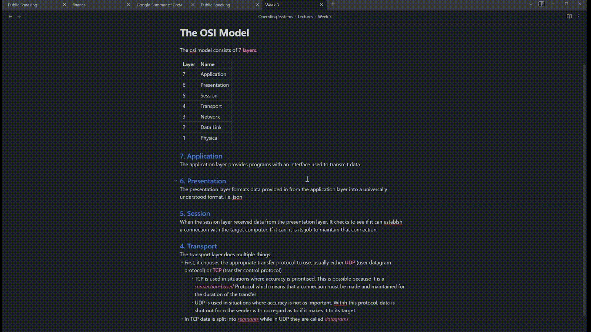

# Gene: An AI assistant for Obsidian

Gene is a Free and open source GPT3 powered AI assistant which allows you to create, modify and enhance your notes.

## Features 

Gene leverages the openai API to allow you to:
- Write anything based off of a highlighted prompt.
- Elaborate on a paragraph or bullet point.
- Edit an area of highlighted text.
- Translate a selected area into whatever language you want.

## How to Install
1. Download the repository to your local pc
2. Move the zip file into your plugins directory (/Documents/Obsidian/\[vaultName]/.obsidian/plugins)
3. Unzip the plugin into that directory

## How to Use
1. Get your private key from openai (create an account if you havent alreaady)
2. Insert your API key into the API key section in settings.
3. Highlight text that contains a prompt or text you want to modify.
4. Using the command pallet or the commands hotkey, run the command
  
## Plans

- Shortcut to have Gene help generate ideas (Like Notion AI)

## Sponsor

